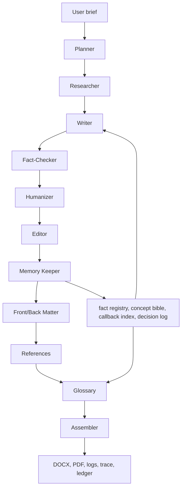

# Architecture

Pattern: orchestrator-worker DAG. `app/orchestration/graph.py` uses LangGraph when installed and a local `SequentialBookGraph` fallback with the same `.invoke(state)` contract when LangGraph is unavailable.

Coordination contract: each agent receives and returns `BookState`. Structured agents return JSON parsed by Pydantic schemas where available. Logs are append-only JSONL. Memory writes are recorded in `memory_io`.

Failure paths: JSON outputs are repaired where risk is highest. Fact-checking uses citation-or-soften rules. PDF assembly first tries LibreOffice and falls back to a ReportLab PDF so the deliverable exists in constrained environments.

Model strategy: generation uses `get_writer_llm()`, extraction/judging uses `get_fast_llm()`. Both route to Groq when configured and fall back to deterministic offline responses for quota-safe tests.
